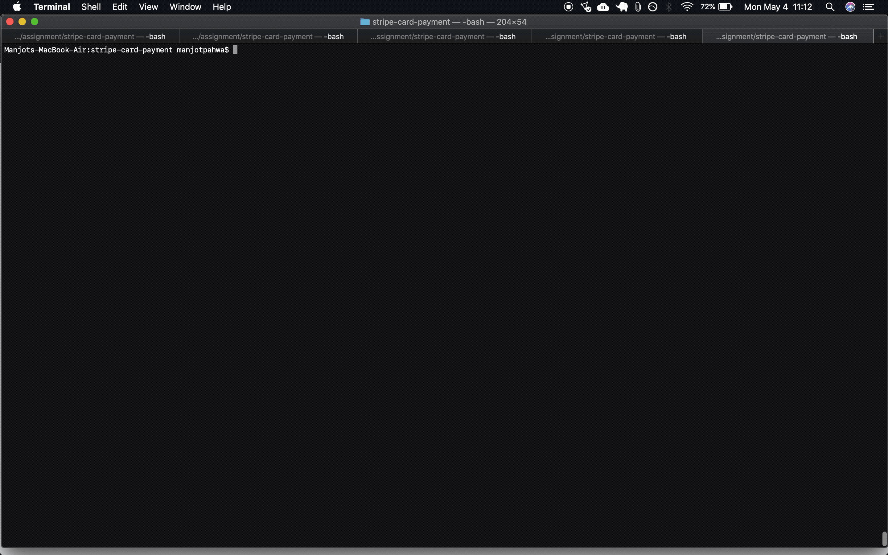

<h1 align="center"> Stripe PaymentIntents API Integration</h1>

Welcome to the Trailblazer Sneaker shop!
[](https://www.npmjs.org/package/tiny-npm-license)

<div align="center">

</div>


As an owner of an ecommerce store, you will want to integrate with the payments API for Stripe. This is a simple way to build a checkout form that collects name, email, card details. Included are some basic build and run scripts you can use to start up the application.

## Overview

This guide is an integration with the PaymentIntents API for  Stripe.
1. The frontend form takes in basic payment details such as name, email and card details. 
1. The backend receives this request and creates a new PaymentIntents request and customer object in Stripe. 
1. Then it makes the payment request to Stripe and sends the client secret back to the frontend.
1. The client confirms the payment using the client secret.
1. Webhooks wait on hearing about the successful completion of the charge and perform post payment actions.


## Setup



### Requirements
You’ll need the following:

1. Python >= 3.6
1. Modern browser that supports ES6.
1. Stripe account to accept payments (sign up for free).

In order to complete the request and update inventory, we need to receive a real-time webhook notification. We're using the Stripe CLI to forward webhook events to our local development server.

### Config
Set your environment variables STRIPE_PUBLISHABLE_KEY and
STRIPE_WEBHOOK_SECRE using the following commands:

```
export STRIPE_PUBLISHABLE_KEY=<your_key>
export STRIPE_WEBHOOK_SECRET=<your_secret>
```

### Build & Run

1. Build the backend server

```
pip3 install -r requirements.txt
```

2. Run the server
Specify the FLASK_APP environment variable and the FLASK_ENV (so that you can see debug logs for a local run of the app).

```
export FLASK_APP=server.py
export FLASK_ENV=development
python3 -m flask run --port=4242
```
Navigate to http://localhost:4242/ to verify your server is up and running. 
To view your total amount go to http://localhost:4242/get-total and to view your cart go to http://localhost:4242/get-cart

3. Build the frontend client app
Run the following to install all dependencies needed.
```
npm install
```

4. Run the client app

```
npm start
```

### Forward events to webhook using Stripe CLI
1. Follow the instructions [here](https://stripe.com/docs/payments/handling-payment-events#install-cli) to install Stripe CLI and login into your account.
1. Forward events locally to your webhook using:
```
stripe listen --forward-to http://localhost:4242/webhook
```

In a different terminal tab, use the following:
```
stripe trigger payment_intent.succeeded
```

You should be able to see the following:
```
[200 POST] OK payment_intent.succeeded
```


### Successful Payment Test

1. Verify your cart is full of the items Nike Zoom Fly 2 units by going to http://localhost:4242/get-cart. Your total of 300 should be visible at http://localhost:4242/get-total.

1. Go to [http://localhost:3000/checkout](http://localhost:3000/checkout). Enter your name and email address in the form provided. Enter card details "4242 4242 4242 4242" for testing a successful payment. Enter any valid values for the rest of the options such as CVV, expiration date and zip code. Press "Pay". You should see the payment go through successfully.

1. Verify your total is now 0 and you cart is now empty by going to http://localhost:4242/get-total and  http://localhost:4242/get-cart respectively.


### Successful Payment with Authentication Test

1. Verify your cart is full of the items Nike Zoom Fly 2 units by going to http://localhost:4242/get-cart. Your total of 300 should be visible at http://localhost:4242/get-total.

1. Go to [http://localhost:3000/checkout](http://localhost:3000/checkout). Enter your name and email address in the form provided. Enter card details "4000 0025 0000 3155" for testing a successful payment. Enter any valid values for the rest of the options such as CVV, expiration date and zip code. Press "Pay". You should see the payment go through successfully.

1. Verify your total is now 0 and you cart is now empty by going to http://localhost:4242/get-total and  http://localhost:4242/get-cart respectively.


### Insufficient Balance Test

1. Verify your cart is full of the items Nike Zoom Fly 2 units by going to http://localhost:4242/get-cart. Your total of 300 should be visible at http://localhost:4242/get-total.

1. Go to [http://localhost:3000/checkout](http://localhost:3000/checkout). Enter your name and email address in the form provided. Enter card details "4000 0000 0000 9995" for testing a successful payment. Enter any valid values for the rest of the options such as CVV, expiration date and zip code. Press "Pay". You should see the payment go through successfully.

1. Verify your total is still 300 and you cart is full of the same items by going to http://localhost:4242/get-total and  http://localhost:4242/get-cart respectively.
